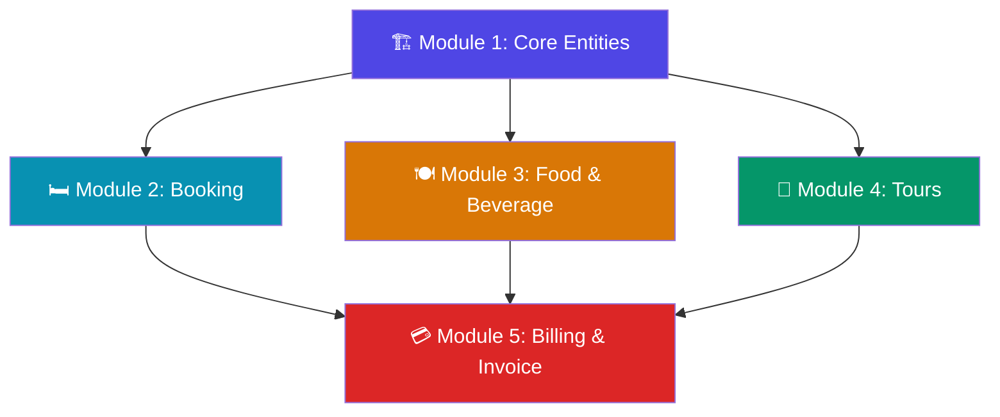
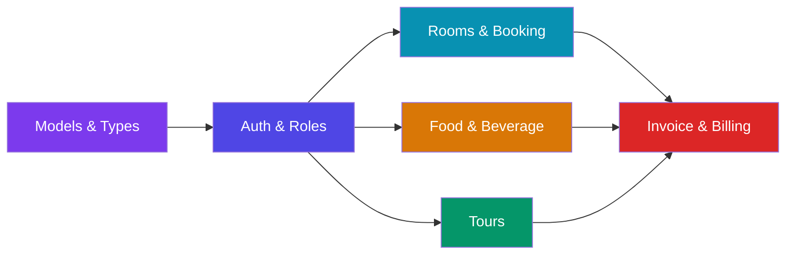

# 🏨 Vitamin See Hotel & POS System — Development Roadmap

## System Overview

Your diagrams define a **full hotel management + POS system** with **4 modules**, **10 entities**, and **8 enums**. Here's the architecture at a glance:



## Current State vs Required State

| Area | Current State | Required |
|------|--------------|----------|
| **Framework** | Next.js 16 + TypeScript ✅ | Ready |
| **Database** | MongoDB connection exists ✅ | Need all models |
| **Models** | `models/` folder is **empty** ❌ | 10 Mongoose models needed |
| **API Routes** | Only `products/` + `db-test/` exist | 8+ route groups needed |
| **UI Components** | Generic (nav, hero, product cards) | Hotel-specific UI needed |
| **Auth** | None ❌ | Staff + Guest auth needed |

---

## 🗺️ Recommended Development Path (6 Phases)

### Phase 1: Foundation & Data Layer (Do This First!)

> [!IMPORTANT]
> **Start here.** Everything else depends on having proper models and database structure.

**Why first:** Every module (Booking, Food, Tours, Billing) reads/writes data. Without models, nothing works.

#### Steps:
1. **Create all Mongoose models** in `models/` folder:
   - `User.ts` — staff (Admin, Waiter, Receptionist)
   - `Guest.ts` — hotel guests
   - `Room.ts` — room inventory
   - `RoomBooking.ts` — reservations
   - `FoodItem.ts` — menu items
   - `FoodOrder.ts` — orders with `OrderItem` embedded
   - `TourPackage.ts` — tour catalog
   - `TourBooking.ts` — tour reservations
   - `Invoice.ts` — consolidated billing

2. **Create shared types/enums** in `lib/types.ts`:
   - `UserRole`, `RoomStatus`, `BookingStatus`, `FoodCategory`, `OrderStatus`, `TourStatus`, `PaymentStatus`, `PaymentMethod`

3. **Fix DB connection** — keep [lib/mongo2.tsx](file:///d:/Next/hottel/lib/mongo2.tsx) but rename to `lib/db.ts`

#### Estimated Time: 2–3 days

---

### Phase 2: Authentication & Core Entities

**Why second:** Staff need to log in before managing anything. Guests need accounts to book/order.

#### Steps:
1. **Staff auth** — Login page + session management (NextAuth.js or custom JWT)
2. **Guest registration** — Self-service sign-up with passport/ID
3. **Role-based access** — Admin sees everything, Waiter sees orders, Receptionist sees bookings
4. **Admin dashboard shell** — Sidebar navigation with module links

#### Folder Structure:
```
app/
├── (auth)/
│   ├── login/page.tsx
│   └── register/page.tsx
├── (admin)/
│   ├── layout.tsx          ← Admin sidebar
│   ├── dashboard/page.tsx
│   ├── rooms/              ← Phase 3
│   ├── food/               ← Phase 4
│   └── tours/              ← Phase 5
├── (guest)/
│   ├── layout.tsx          ← Guest navigation
│   ├── booking/page.tsx    ← Phase 3
│   ├── menu/page.tsx       ← Phase 4
│   └── tours/page.tsx      ← Phase 5
└── api/
    ├── auth/
    ├── rooms/              ← Phase 3
    ├── bookings/           ← Phase 3
    ├── food-items/         ← Phase 4
    ├── food-orders/        ← Phase 4
    ├── tours/              ← Phase 5
    ├── tour-bookings/      ← Phase 5
    └── invoices/           ← Phase 6
```

#### Estimated Time: 3–4 days

---

### Phase 3: Room Booking Module

**Why third:** Rooms are the core hotel product. Guests need to book rooms before ordering food or tours.

#### Steps:
1. **API routes** — CRUD for `Room` + `RoomBooking`
2. **Admin Panel:**
   - Room management (add/edit/delete rooms, set amenities)
   - View all bookings, confirm/cancel bookings
   - Room status dashboard (Available/Occupied/Cleaning)
3. **Guest Panel:**
   - Browse available rooms with filters (type, price, amenities)
   - Book a room (date picker, guest count)
   - View/cancel own bookings
4. **Room status lifecycle** — Auto-update: Available → Occupied → Cleaning → Available

#### Key Logic from Your Diagrams:
- Room ↔ RoomBooking is **1:N** (room reusable after checkout)
- Implement `Room.updateStatus()` as state machine
- Add `CancellationReason` + `CancelledAt` for cancellations

#### Estimated Time: 4–5 days

---

### Phase 4: Food & Beverage Module

**Why fourth:** Once guests are checked in, they order food. This is the POS heart of the system.

#### Steps:
1. **API routes** — CRUD for `FoodItem`, `FoodOrder` + `OrderItem`
2. **Admin/Waiter Panel:**
   - Menu management (add items, set prices, toggle availability, upload images)
   - Take orders on behalf of guests (waiter-initiated)
   - Update order status (Pending → Confirmed → Preparing → Ready → Served)
3. **Guest Panel:**
   - Browse menu by category (Food, Beverage, Bar, Dessert)
   - Place self-service orders with notes/special requests
   - Track order status in real-time
4. **Dual-mode ordering** — `getOrderedBy()` derives from `WaiterID` (NULL = Guest, else = Waiter)

#### Key Logic from Your Diagrams:
- `OrderItem` stores `UnitPrice` snapshot (prices may change after ordering)
- `Notes` + `SpecialRequests` fields for dietary needs
- Removed redundant `OrderedBy` field — derive it

#### Estimated Time: 5–6 days

---

### Phase 5: Tour Booking Module

**Why fifth:** Tours are an add-on service. Less critical than rooms/food but part of billing.

#### Steps:
1. **API routes** — CRUD for `TourPackage` + `TourBooking`
2. **Admin Panel:**
   - Manage tour packages (Pigeon Island, Kandy, etc.)
   - View/manage all tour bookings
3. **Guest Panel:**
   - Browse available tours
   - Book tours (select date, guest count)
   - Cancel with reason tracking

#### Estimated Time: 3–4 days

---

### Phase 6: Billing & Invoice Module (Build Last!)

> [!CAUTION]
> **Build this last.** The invoice aggregates data from ALL other modules (Rooms + Food + Tours). It can't work until the others are complete.

#### Steps:
1. **API routes** — Generate/view/pay invoices
2. **Invoice generation at checkout:**
   - Sum `RoomTotal` from RoomBooking
   - Sum `FoodTotal` from FoodOrders
   - Sum `TourTotal` from TourBookings
   - Apply configurable `ServiceChargePercentage`
   - Calculate `GrandTotal`
3. **Payment processing** — Track method (Cash/Card/UPI/Bank Transfer) + status
4. **PDF generation** + email receipt
5. **Guest view** — Live bill tracking during stay

#### Key Logic from Your Diagrams:
- `Guest ↔ Invoice` is 1:1 **per checkout** (not lifetime)
- Service charge is configurable, not hardcoded at 10%
- Add `PaymentMethod` enum + `TransactionID` for audit

#### Estimated Time: 4–5 days

---

## ⚡ Quick Wins (Things to Fix Now)

| # | Issue | Action |
|---|-------|--------|
| 1 | `models/` folder is empty | Start creating models immediately |
| 2 | [code.ts](file:///d:/Next/hottel/code.ts) at root has sample code | Move to proper model/route or delete |
| 3 | [lib/mongo2.tsx](file:///d:/Next/hottel/lib/mongo2.tsx) should be `lib/db.ts` | Rename for clarity |
| 4 | Components are generic (ProductCard, HeroSlider) | Replace with hotel-specific components |
| 5 | No shared types file | Create `lib/types.ts` with all enums from diagrams |

---

## 🔑 Module Dependency Order (Critical Path)



> [!TIP]
> **Phases 3, 4, and 5 can be developed in parallel** once the foundation (Phase 1) and auth (Phase 2) are complete. Phase 6 (Billing) **must** come last.

---

## 📁 Recommended Final Folder Structure

```
hottel/
├── app/
│   ├── (auth)/login/ & register/
│   ├── (admin)/dashboard/, rooms/, food/, tours/, invoices/
│   ├── (guest)/booking/, menu/, tours/, invoice/
│   └── api/auth/, rooms/, bookings/, food-items/, food-orders/, tours/, tour-bookings/, invoices/
├── models/
│   ├── User.ts, Guest.ts, Room.ts, RoomBooking.ts
│   ├── FoodItem.ts, FoodOrder.ts
│   ├── TourPackage.ts, TourBooking.ts
│   └── Invoice.ts
├── lib/
│   ├── db.ts (MongoDB connection)
│   ├── types.ts (all enums & shared types)
│   ├── auth.ts (auth utilities)
│   └── utils.ts (existing)
├── components/
│   ├── ui/ (reusable: Button, Input, Card, Modal, Table)
│   ├── admin/ (AdminSidebar, RoomStatusBadge, OrderStatusTracker)
│   └── guest/ (RoomCard, MenuItemCard, TourCard, InvoiceSummary)
└── diagrams/ (keep as documentation reference ✅)
```

---

## Summary: Start Coding in This Exact Order

| Order | Task | Est. Time |
|-------|------|-----------|
| **1** | Create all Mongoose models + shared types | 2–3 days |
| **2** | Authentication + role-based access | 3–4 days |
| **3** | Room & Booking module (API + UI) | 4–5 days |
| **4** | Food & Beverage module (API + UI) | 5–6 days |
| **5** | Tour Booking module (API + UI) | 3–4 days |
| **6** | Billing & Invoice module (API + UI) | 4–5 days |
| **7** | Polish, testing, & deployment | 3–4 days |
| | **Total estimated** | **~25–30 days** |
